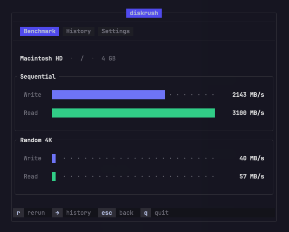

<p align="center">
  
</p>

<h3 align="center">diskrush</h3>
<p align="center">Blazing-fast disk benchmark TUI, built in Rust.</p>

<p align="center">
  <a href="https://crates.io/crates/diskrush"></a>
  <a href="LICENSE"></a>
</p>

---

A single-binary, zero-dependency TUI that measures real disk throughput with sequential and random 4K benchmarks. Runs on macOS, Linux, and Windows.

## Install

```
brew install arthurrmp/tap/diskrush
```

## Usage

```
diskrush
```

Select a drive and the benchmark runs. Results are saved to the History tab automatically.

### Headless

```bash
diskrush --headless
diskrush --headless --path /mnt/nvme --size 1024
diskrush --headless --json
```

## Keybindings

| Key | Action |
|-----|--------|
| `Enter` | Select / toggle |
| `r` | Rerun |
| `j`/`k` or `Up`/`Down` | Navigate |
| `Left`/`Right` | Switch tab |
| `Esc` | Back |
| `q` | Quit |

## License

[MIT](LICENSE)
